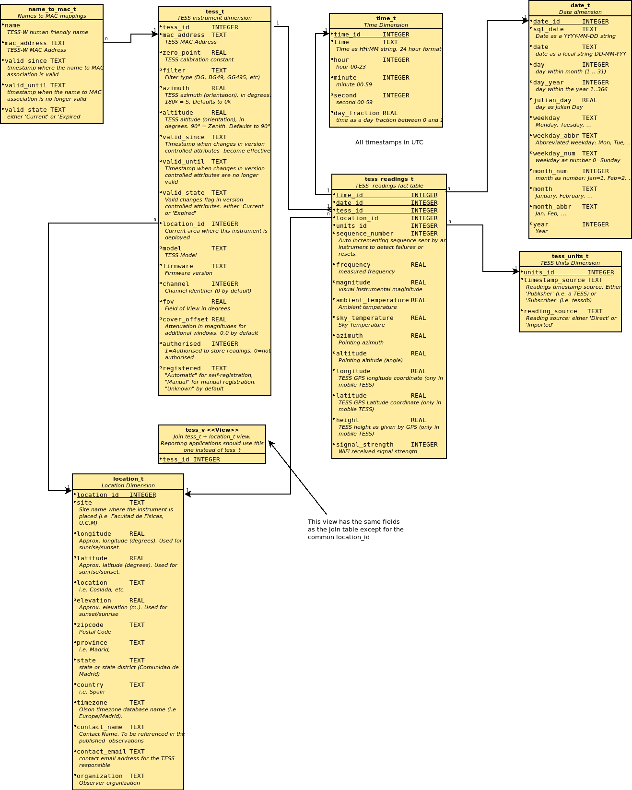

# tessdb (overview)

Linux service to collect measurements pubished by TESS Sky Quality Meter via MQTT. TESS stands for [Cristobal Garcia's Telescope Encoder and Sky Sensor](http://www.observatorioremoto.com/TESS.pdf)

TESSDB is being used as part of the [STARS4ALL Project](https://guaix.fis.ucm.es/splpr/TESS-V1).

## Description

**tessdb** is a software package that collects measurements from one or several
TESS instruments into a SQLite Database.  

It is a [Python Twisted Application](https://twistedmatrix.com/trac/)
that uses a [custom Twisted library implementing the MQTT protocol](https://github.com/astrorafael/twisted-mqtt)

Desktop applicatons may query the database to generate reports and graphs
using the accumulated, historic data.

The Windows version works as a Windows service, but the Linux version has further functionality like servcie reload and automatic daily logfile and rotation.

These data sources are available:

+ individual samples (real time, 5 min. aprox between samples).

Instrument should send their readings at twice the time resolution specified in the config file (in seconds).

**Warning**: Time is UTC, not local time.

# INSTALLATION
    
## Linux installation (Debian)

## Requirements

The following components are needed and should be installed first:

 * python 2.7.x (tested on Ubunti python 2.7.6)

### Installation

Installation via PyPi repository

  `sudo pip install tessdb`

or from GitHub:

    git clone https://github.com/astrorafael/tessdb.git
    cd tessdb
    sudo python setup.py install


* All executables are copied to `/usr/local/bin`
* The database is located at `/var/dbase/tess.db` by default
* The log file is located at `/var/log/tessdb.log`
* The following required PIP packages will be automatically installed:
    - twisted,
    - twisted-mqtt
    - pyephem
    - tabulate
    
### Start up Verification

Type `sudo tessdb -k` to start the service in foreground with console output.
Verify that it starts without errors or exceptions.

Type `sudo service tessdb start` to start it as a backgroud service.
Type `sudo update-rc.d tessdb defaults` to start it at boot time.

## Windows installation

## Requirements

(Tested on Windows XP SP1 & python 2.7.10)
* Have [Python 2.7 for Windows](https://www.python.org/downloads/windows/) installed.
* Have [PythonWin extensions](http://sourceforge.net/projects/pywin32/files/pywin32/) installed. select the latest build
fpr the **Pyhton2.7 version**
* Have the [Microsoft Visual C++ Compiler for Python 2.7](https://www.microsoft.com/en-us/download/details.aspx?id=44266) installed. Thos is necessary to install `twisted` later on. Systems requirements state for Windows 7+, but it works fine for Windows XP, 32bits. 

### Installation

The Windows python 2.7 distro comes with the pip utility included. 

1. Open a `CMD.exe` console, **with Administrator privileges for Windows 7 and higher**
2. Inside this console type:

`pip install twisted`

Twisted will install (15.5.0 at this moment)

You can test that this installation went fine by opening a python command line (IDLE or Python CMD)
and type:

	```
	>>> import twisted
	>>> print twisted.__version__
	15.5.0
	>>> _
	```

3. Inside this new created folder type:

 `pip install tessdb`

* The executables (.bat files) are located in the same folder `C:\tessdb`
* The database is located at `C:\tessdb\dbase` by default. It is strongly recommeded that you leave it there.
* The log file is located at `C:\tessdb\log\tessdb.log`
* The following required PIP packages will be automatically installed:
    - twisted,
    - twisted-mqtt
    - pyephem
    - tabulate
    
### Start up and Verification

In the same CMD console, type`.\tessdb.bat`to start it in forground and verify that it starts without errors or exceptions.

Go to the Services Utility and start the TESSDB database service.


# CONFIGURATION

There is a small configuration file for this service:

* `/etc/tessdb/config` (Linux)
* `C:\tessdb\config.ini` (Windows)

This file is self explanatory. 
In special, the database file name and location is specified in this file.
Some of the properities marked in this file are makred as *reloadable property*. This means that this value can be changed and the process reloads its new value on the fly.

## Logging

Log file is usually placed under `/var/log/tessdb.log` in Linux or under `C:\tessdb\log` folder on Windows. 
Default log level is `info`. It generates very litte logging at this level.
File is rotated by logrotate **only under Linux**. 
For Windows, it requires support from an exteral log rotator software such as [LogRotateWin](http://sourceforge.net/projects/logrotatewin/)

## Server Start/Stop/Restart

### Under Linux

* Service status: `sudo service emadb status`
* Start Service:  `sudo service emadb start`
* Stop Service:   `sudo service emadb stop`
* Restart Service: `sudo service emadb restart`. A service restart kills the process and then starts a new one

### Under Windows

The start/stop/pause operations can be performed with the Windows service GUI tool
**If the config.ini file is not located in the usual locatioon, you must supply its path to the tool as extra arguments**

## Server Pause

The server can be put in *pause mode*, in which will be still receiving incoming MQTT messages but will be internally enquued and not written to the database. This is usefull to perform delicate operations on the database without loss of data. Examples:

* Compact the database using the SQLite VACUUM pragma
* Migrating data from tables.
* etc.

### Under Linux

To pause the server, type: `sudo service emadb pause` and watch the log file output wit `tail -f /var/log/emadb.log`

To resume normal operation type `sudo service tessdb resume` and wautch the same log file. Service pause/resume use signals `SIGUSR1` and `SIGUSR2`.

### Under Windows

Server pause/resume is made through the standard service GUI tool by clicking the Pasue and Resume buttons.

##  Service reload

During a reload the service is not stopped and re-reads the new values form the configuration file and apply the changes. In general, all aspects not related to maintaining the current connection to the MQTT broker or changing the database schema can be reloaded. The full list is described in the section B above.

* *Linux:* The `service emadb reload` will keep the MQTT connection intact. 
* *Windows:* There is no GUI button in the service tool for a reload. You must execute an auxiliar script `C:\emadb\winreload.py` by double-clicking on it. 

In both cases, watch the log file to ensure this is done.


# DATA MODEL

## Dimensional Modelling

The data model follows the [dimensional modelling]
(https://en.wikipedia.org/wiki/Dimensional_modeling) approach by Ralph Kimball. More references can also be found in [Star Schemas](https://en.wikipedia.org/wiki/Star_schema).

## The data model

The figure below shows the layout of **tessdb**.



### Dimension Tables

* `date_t`      : preloaded from 2016 to 2026
* `time_t`      : preloaded, with seconds resolution (configurable)
* `tess_t`      : registered TESS instruments collecting data
* `location_t`  : locations where instruments are deployed
* `tess_units_t`     : an assorted collection of unit labels for reports, preloaded with current units.
* `tess_v`      : View with TESS instrument and current location. It is recommended that reporting applications use this view, instead of the underlying `tess_t` and `location_t` tables.

#### Instrument Dimension

This dimension holds the current list of TESS instruments. 

* The real key is an artificial key `tess_id` linked to the Fact table.
* The `mac_address` could be the natural key if it weren't for the calibration constant history tracking.
* The `name` attribute could be an alternative key for the same reason. TESS instruments send readings using this name.
* A TESS instrument name can be changed as long as there is no other instrument with the same name.
* The `location_id` is a reference to the current location assigned to the instrument.
* Location id -1 denotes the "Unknown" location.
* The `calibration_k` holds the current value of the instrument calibration constant.
* A history of calibration constant changes are maintained in the `tess_t` table if the instrument is ever recalibrated. 
* Columns `calibrated_since` and `calibrated_until`hold the timestamps where the calibration constant is valid. 
* Column `calibrated_state` is an indicator. Its values are either **`Current`** or **`Expired`**. 
* The current calibration constant has its indicator set to `Current` and the expiration date in a far away future (Y2999).

#### Unit dimension

The `tess_units_t` table is what Dr. Kimball denotes as a *junk dimension*. It collects various labels denoting
the current measurement units of samples in the fact table. 

* Columns `valid_since`, `valid_until` and `valid_state` keep track of units change in a similar technique as above should the units change.

### Fact Tables

* `tess_readings_t` : Accumulating snapshot fact table containing measurements from several TESS instruments.

TESS devices with accelerometer will send `azimuth` and `altitude` values, otherwise they are `NULL`.

TESS devices with a GPS will send `longitude`, `latitude` and `height` values, otherwise they are `NULL`.

# MQTT PAYLOAD INFORMATION

Payloads are transmitted in JSON format, with the format described below.

## Published on  topic 'STARS4ALL/{channel}/reading'

| Field name |  Type  | Units | Optional | Description                       |
|:----------:|:------:|:-----:|:--------:|:----------------------------------|
| seq        | int    |   -   | mand  | Sequence number. If possible use 32 bits. The sequence number will start in 1 at each device reboot. |
| name       | string |   -   | mand  | Instrument friendly name. Should be unique as it identifies the device. |
| freq       | float  | Hz    | mand  | Raw reading as a frequency with 3 decimal digits precision (millihertz) NNNNN.NNN |
| mag        | float  | mag/arcsec^2 | mandat. | Visual magnitude (formulae?) corresponding to the raw reading). Transmitted up to two decimal places NN.NN |
| tamb       | float   | ºC    | mandat. | Ambient Temperature. Transmitted up to one decimal place. |
| tsky       | float   | ºC    | mandat.  | Sky Temperature. Transmitted up to one decimal place. |
| az         | int     | deg | opt | Photometer optical axis Azimuth sent only on instruments with accelerometer. |
| alt | int | deg | opt | Photometer optical axis Altitude (angle): sent only on instruments with accelerometer. |
| lat | float | deg | opt | Instrument latitude. Only sent by instruments with GPS integration.
| long | float | deg | opt | Instrument longitude. Only sent by instruments with GPS integration. |
| height | float | meters | opt | Instrument height above the sea level. Only sent by instruments with GPS integration. |
| rev | int | - | mand | Payload data format revision number. Current version is 1. |
| tstamp | string | UTC | opt | Timestamp,“YYYY-MM-DDTHH:MM:SS” format. Must be UTC. |

## Published on  topic 'STARS4ALL/register'

| Field name |  Type  | Units | Optional | Description                       |
|:----------:|:------:|:-----:|:--------:|:----------------------------------|
| name  | string | - | mand | Instrument friendly name. Should be unique as it identifies the device. |
| mac   | string | - | mand. | Device MAC address, format “xx:yy:zz:rr:ss:tt” |
| calib | float  | mag/arcsec^2 | mand | Per-device calibrated Instrumental constant. Transmitted as NN.NN floating point. |
| rev   | int    | - | mand | Payload data format revision number. Current version is 1. |
| chan  | string | - | opt | Channel where this instrument will publish its readings. |

# OPERATION & MAINTENANCE

## TESS instruments and locations
There is no master file concerning TESS instruments since they register themselves on power-up.

There is a master file of all locations relevant to the deployment of TESS instruments: `config/locations.json`).

It is not possible to assign beforehand where a given TESS instruments will be deployed. Besides, a given TESS instruments could be temporally moved from one site to another. So, to maintain the current location where a given TESS is deployed, there is another file named `config/tess_location.json` where this relationship is established.

## Instrument filtering
*For personal use only*. In order to reject readings from other TESS instruments coming to your own personal database, you can specify an instrument name (or a list of instrument names). All readings whose instrument names do no match the one defined in the configuration file will be silently discarded.

## Sunrise / Sunset filtering
It is recommended to activate the sunrise/sunset filter to reject TESS readings coming in daytime and avoid unnecessary grouth in the database.
Each location has a latitude (degrees), longitude (degrees) and elevation (meters) which can be neglected is this filter is not used. 

Activating this filter have the following conecuences:
1. Once a day, at arount 00:00 UTC, all locations will have their sunrise and sunset time computed, according to the local horizon defined (configurable).
2. Instruments assigned to locations found to be in daytime will have their readings rejected.
2. ***Instruments not assigned to a known location will have their readings rejected***.
3. Instruments assigned to Locations with `NULL` or `Unknown` longitude, latitude or elevation columns will have their readings rejected.

## SQLite Database Maintenance
***Only in Linux*** The database and log file are rotated daily by a cron script file at 12:00 UTC. This is done to prevent a costly file copy at midnight, precisely when the database is busy writting samples. The program 
is first put in pause mode, do the copy and then resumes operation.

## The `tess` utility

`tess` is a command line utility to perform some actions on the database without having to write SQL statements.

It has several subcommands. You can find the all by typing `tess --help`
```
pi@rb-tess:~ $ tess --help
usage: /usr/local/bin/tess [-h] {instrument,location,readings} ...

positional arguments:
  {instrument,location,readings}
    instrument          instrument commands
    location            location commands
    readings            readings commands

optional arguments:
  -h, --help            show this help message and exit
```

Each subcommand has its own help that you may display by issuing `tess <subcommand> --help`

Example:
```
pi@rb-tess:~ $ tess location list --help
usage: /usr/local/bin/tess location list [-h] [-p PAGE_SIZE] [-d DBASE]

optional arguments:
  -h, --help            show this help message and exit
  -p PAGE_SIZE, --page-size PAGE_SIZE
                        list page size
  -d DBASE, --dbase DBASE
                        SQLite database full file path
```


### Listing locations
`tess location list`
```
+-----------------------------------------+-------------+------------+-------------+
| Name                                    |   Longitude |   Latitude |   Elevation |
+=========================================+=============+============+=============+
| Laboratorio de Cristobal                |    -nn.nnnn |    nn.nnnn |         nnn |
+-----------------------------------------+-------------+------------+-------------+
| Centro de Recursos Asociativos El Cerro |    -3.5515  |    40.4186 |         650 |
+-----------------------------------------+-------------+------------+-------------+
```

### Listing TESS instruments
`tess instrument list`

```
+---------+---------+-------------+------------+-------------+
| TESS    | Site    | Longitude   | Latitude   | Elevation   |
+=========+=========+=============+============+=============+
| pruebas | Unknown | Unknown     | Unknown    | Unknown     |
+---------+---------+-------------+------------+-------------+
| stars1  | Unknown | Unknown     | Unknown    | Unknown     |
+---------+---------+-------------+------------+-------------+
```


### Assign a location to an instrument
The most important use of the tess utility is to assign an existing location to an instrument, since brand new registered instruments are assigned to a default *Unknown* location. This must be issued with `sudo`, since it requires a DB write.

`sudo tess assign pruebas "Laboratorio de Cristobal"`

```
+---------+--------------------------+-------------+------------+-------------+
| TESS    | Site                     |   Longitude |   Latitude |   Elevation |
+=========+==========================+=============+============+=============+
| pruebas | Laboratorio de Cristobal |    -n.nnnnn |    nn.nnnn |         nnn |
+---------+--------------------------+-------------+------------+-------------+
```

`tess instrument list`

```
+---------+--------------------------+-------------+------------+-------------+
| TESS    | Site                     | Longitude   | Latitude   | Elevation   |
+=========+==========================+=============+============+=============+
| pruebas | Laboratorio de Cristobal | -nn.nnnnnnn | nn.nnnnnnn | nnn.n       |
+---------+--------------------------+-------------+------------+-------------+
| stars1  | Unknown                  | Unknown     | Unknown    | Unknown     |
+---------+--------------------------+-------------+------------+-------------+
```

### Create a brand new TESS instrument
If automatic registration fails, this command allows manual creation of a TESS instrument in the database

`tess instrument create {name} {mac} {calibration constant}`

### Renaming a TESS instrument
If for some reason, an instrument needs to change the friendly user name, this command allows you to do so.
`tess instrument rename {old name} {new name}`

+---------+-------------------+---------------+----------+-------------+------------+-------------+
| TESS    | MAC Addr.         |   Calibration | Site     |   Longitude |   Latitude |   Elevation |
+=========+===================+===============+==========+=============+============+=============+
| pruebas | 18:FE:34:9C:AD:ED |          1.61 | Pamplona |    n.nnnnn |    nn.nnnn |         nnn |
+---------+-------------------+---------------+----------+-------------+------------+-------------+


### Updating the calibration constant
If, for some reason, we need to change the instrument calibration constant, this command allows you to do so.
`tess instrument update {name} {new calibration constant}`

```
+---------+---------------+---------+---------------------+---------------------+----------+
| TESS    |   Calibration | State   | Since               | Until               | Site     |
+=========+===============+=========+=====================+=====================+==========+
| pruebas |          1.65 | Expired | 2016-04-06T14:35:52 | 2016-05-07T16:36:22 | Pamplona |
+---------+---------------+---------+---------------------+---------------------+----------+
| pruebas |          1.6  | Expired | 2016-05-07T16:36:22 | 2016-07-30T14:29:25 | Pamplona |
+---------+---------------+---------+---------------------+---------------------+----------+
| pruebas |          1.69 | Expired | 2016-07-30T14:29:25 | 2016-07-30T14:39:01 | Pamplona |
+---------+---------------+---------+---------------------+---------------------+----------+
| pruebas |          1.63 | Expired | 2016-07-30T14:39:01 | 2016-07-30T16:05:31 | Pamplona |
+---------+---------------+---------+---------------------+---------------------+----------+
| pruebas |          1.61 | Current | 2016-07-30T16:05:31 | 2999-12-31T23:59:59 | Pamplona |
+---------+---------------+---------+---------------------+---------------------+----------+
```

### Listing TESS readings
`test readings list`
```
+--------------+--------+------------+-------------+-------------+
| Timestamp    | TESS   | Location   | Frequency   | Magnitude   |
+==============+========+============+=============+=============+
+--------------+--------+------------+-------------+-------------+
```


# Sample SQL Queries

1. Get a daily report of readings per instrument:

```sh
#!/bin/bash
sqlite3 /var/dbase/tess.db <<EOF
.mode column
.headers on
SELECT d.sql_date, i.name, count(*) AS readings
FROM tess_readings_t AS r
JOIN tess_t AS i USING (tess_id)
JOIN date_t AS d USING (date_id)
GROUP BY r.date_id, r.tess_id
ORDER BY d.sql_date DESC;
EOF
```

2. Extract all readings for a given instrument:

```sh
#!/bin/bash
instrument_name=$1
sqlite3 -csv -header /var/dbase/tess.db <<EOF
SELECT (d.julian_day + t.day_fraction) AS julian_day, (d.sql_date || 'T' || t.time) AS timestamp, r.sequence_number, l.site, i.name, r.frequency, r.magnitude, i.calibration_k, r.sky_temperature, r.ambient_temperature
FROM tess_readings_t AS r
JOIN tess_t          AS i USING (tess_id)
JOIN location_t      AS l USING (location_id)
JOIN date_t          AS d USING (date_id)
JOIN time_t          AS t USING (time_id)
WHERE i.name = "${instrument_name}"
ORDER BY r.date_id ASC, r.time_id ASC;
EOF

```


